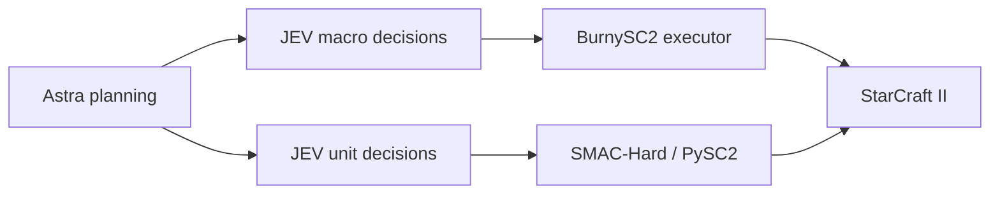
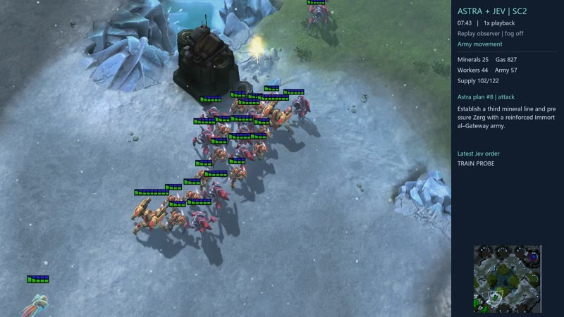
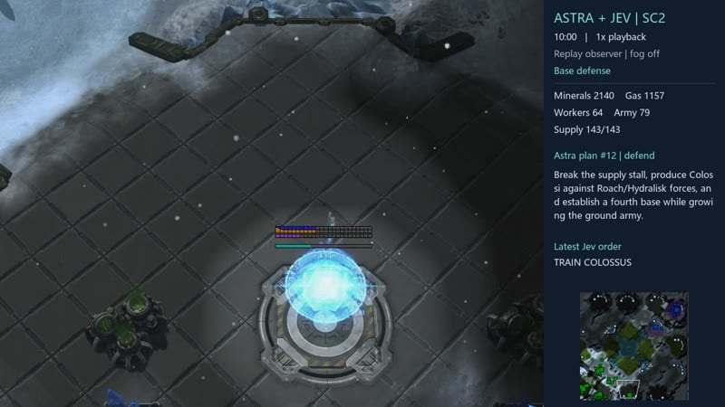
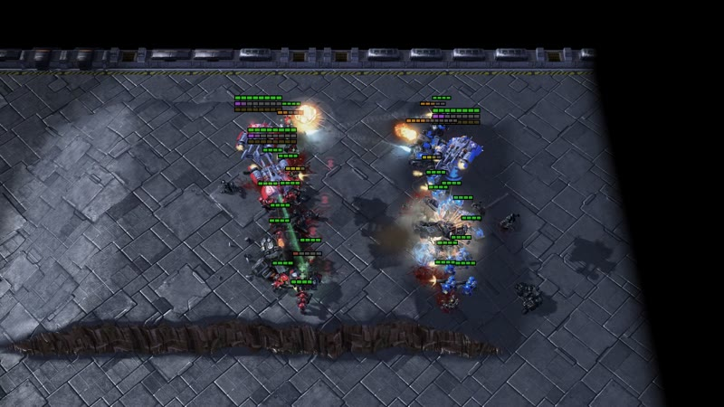

# JEV-Star

[English](#english) | [简体中文](#简体中文)

**StarCraft II macro and micromanagement with JEV action selection and optional GPT-6 Astra planning.**

**由 JEV 选择动作、可选 GPT-6 Astra 规划的星际争霸 II 宏观控制与微操。**

## English

JEV-Star brings full-game macro control and SMAC-Hard micromanagement into one repository. Each module has its own environment, action space, and experiment records:

| Module | Game interface | Model responsibilities | Current implementation |
| --- | --- | --- | --- |
| [Macro](macro/README.md#english) | LLM Play SC2 / BurnySC2 | Astra plans strategic phases; JEV selects economy, technology, production, and army actions | `macro-v2.2.1`; Protoss; 73 actions; real-time games |
| [Micro](micro/README.md#english) | PySC2 bundled with SMAC-Hard | Astra creates one plan per map; JEV selects actions for living units | `p0-v1`; 35 maps; fixed stepping with `realtime=False` |



### Victory videos and replays

Three reviewed victories are available at **22.4 fps, original speed**, with their original replays:

| Macro: VeryHard / Elite | Macro: Easy | Micro: P0 mmmt |
| --- | --- | --- |
| [](https://github.com/histmeisah/Jev_Star/releases/download/media-20260923/M01-macro-veryhard-seed1-22p4.mp4) | [](https://github.com/histmeisah/Jev_Star/releases/download/media-20260923/M02-macro-easy-seed1-22p4.mp4) | [](https://github.com/histmeisah/Jev_Star/releases/download/media-20260923/U01-micro-mmmt-p0-episode1-22p4.mp4) |
| 12:48 · Astra + JEV v2.1 | 15:04 · Earlier Astra + JEV | 00:21 · P0 Astra + JEV |

[Video gallery and 22 winning replays](media/README.md#english) · [Download release assets](https://github.com/histmeisah/Jev_Star/releases/tag/media-20260923). These are selected victories; the complete evaluation results are below.

### Quick start

The validated setup is **Windows, Python 3.10, and SC2 5.0.16.97563 installed for the Asia region (`kr`)**. Install the SC2 client separately; matches are created through the local SC2 API. The two modules use separate virtual environments to keep their SC2 SDK dependencies isolated.

```powershell
git clone https://github.com/histmeisah/Jev_Star.git
cd Jev_Star
py -3.10 scripts/setup_environment.py macro
py -3.10 scripts/setup_environment.py micro --video

$env:SC2PATH = 'C:\game\StarCraft II'
$env:TYPESAFE_API_KEY = '<your TypeSafe API key>'
py -3.10 scripts/install_maps.py all
```

Alternatively, copy [config.example.md](config.example.md) to a local `config.md`. Git ignores the real key file. Astra planning uses an authenticated native Codex CLI installation; use `--codex-path` to specify its executable explicitly.

Before running macro games, launch the installed SC2 client once to generate `stableid.json`, then synchronize the BurnySC2 enums. Use the version of your installed client:

```powershell
& .\.venvs\macro\Scripts\python.exe -B scripts/sync_sc2_ids.py --game-version 5.0.16.97563
```

Run one macro game:

```powershell
py -3.10 jev_star.py macro --planner codex --planner-effort medium --map 'Altitude LE' --opponent-race Zerg --difficulty Easy --game-time-limit 1200
```

Run three micro episodes on `3m`:

```powershell
py -3.10 jev_star.py micro --map 3m --episodes 3 --planner codex --planner-effort medium --planner-timeout 180 --request-timeout 15 --max-requests 10000
```

Use `py -3.10 jev_star.py macro --help` or `micro --help` for all options. Relative paths in forwarded arguments are resolved inside `macro/` or `micro/`.

### Experiment status

Each micro version was evaluated on 35 maps with three episodes per map. JEV alone achieved **3 wins, 2 draws, and 100 losses**; the earlier Astra + JEV version achieved **6 wins, 1 draw, and 98 losses**; P0 Astra + JEV achieved **7 wins and 98 losses**. Excluding the two development maps, the three versions achieved **3/99, 3/99, and 7/99 wins**, respectively.

Earlier macro versions won two games against the non-cheating VeryHard/Elite AI. The subsequent version with expanded action coverage lost one game each against CheatVision and CheatMoney. The current `macro-v2.2.1` adds termination on permanent billing errors and has passed **102 offline regression tests**; no additional game results have been recorded since that change while awaiting restored API credit. Micro has passed **37 offline regression tests**. These are small samples, not estimates of a stable win rate.

[Experiments and version boundaries](docs/experiments.md) · [Architecture and data flow](docs/architecture.md) · [Logs and replays](docs/logs-and-replays.md) · [Paper PDF](paper/JEV-Star.pdf) · [Paper source and data](paper/README.md#english)

### Repository layout

```text
macro/       Macro controller, tests, and six ladder maps
micro/       Micro controller, PySC2/SMAC-Hard runtime, tests, and 35 maps
scripts/     Environment setup, map installation, and SC2 enum synchronization
docs/        Architecture, experiments, cleanup notes, and source manifest
paper/       Current paper, LaTeX source, figures, and fixed analysis data
licenses/    Upstream licenses
jev_star.py  Unified command entry point for the two isolated environments
```

Run outputs are stored under each module's `jev_runs/` directory. Full events, generated replays and videos, virtual environments, credentials, and machine diagnostics are excluded from Git; the original research archives remain in the local workspace. The reviewed winning replays under `media/replays/` are explicitly included, with videos distributed as release assets. The repository also includes the paper's fixed statistical tables. Excerpts do not replace complete original logs.

### Tests

```powershell
Push-Location macro
& ..\.venvs\macro\Scripts\python.exe -B -m unittest discover -s tests -p 'test_jev*.py'
Pop-Location
Push-Location micro
& ..\.venvs\micro\Scripts\python.exe -B -m unittest discover -s tests -p 'test_jev*.py'
Pop-Location
```

Tests use mocked interfaces and do not launch the game or call paid models. GitHub Actions runs the same two offline test suites. See the [cleanup record](docs/repository-cleanup.md) for the scope of the initial publication checks.

### Upstream sources

Macro is based on [LLM Play SC2](https://github.com/histmeisah/Large-Language-Models-play-StarCraftII). Micro is based on [SMAC-Hard](https://github.com/devindeng94/smac-hard) and its bundled PySC2. Original source notices and applicable licenses are retained; see [third-party notices](THIRD_PARTY_NOTICES.md) and the [source manifest](docs/source-manifest.json).

## 简体中文

JEV-Star 将完整对局的宏观控制与 SMAC-Hard 微操放在同一个仓库中维护。两个模块各有独立环境、动作空间和实验记录：

| 模块 | 游戏接口 | 模型职责 | 当前实现 |
| --- | --- | --- | --- |
| [宏观 macro](macro/README.md#简体中文) | LLM Play SC2 / BurnySC2 | Astra 阶段规划，JEV 选择经济、科技、生产和军队动作 | `macro-v2.2.1`；Protoss；73 个动作；实时对局 |
| [微观 micro](micro/README.md#简体中文) | SMAC-Hard 自带的 PySC2 | Astra 每图一份计划，JEV 为存活单位选择动作 | `p0-v1`；35 张图；固定步进 `realtime=False` |


### 胜局视频与回放

已公开 **3 部胜局视频，均为 22.4 fps、原速播放**，附对应原始 replay：

| 视频 | 版本 | 时长 |
| --- | --- | --- |
| [M01 · 宏观 VeryHard / Elite 胜局](https://github.com/histmeisah/Jev_Star/releases/download/media-20260923/M01-macro-veryhard-seed1-22p4.mp4) | Astra + JEV v2.1 | 12:48 |
| [M02 · 宏观 Easy 胜局](https://github.com/histmeisah/Jev_Star/releases/download/media-20260923/M02-macro-easy-seed1-22p4.mp4) | 早期 Astra + JEV | 15:04 |
| [U01 · 微观 mmmt 第 1 局胜利](https://github.com/histmeisah/Jev_Star/releases/download/media-20260923/U01-micro-mmmt-p0-episode1-22p4.mp4) | P0 Astra + JEV | 00:21 |

[视频预览与 22 份胜局 replay 清单](media/README.md#简体中文) · [下载全部发布附件](https://github.com/histmeisah/Jev_Star/releases/tag/media-20260923)。这里展示选定胜局，完整实验成绩见下文。

### 快速开始

已验证环境为 **Windows、Python 3.10、SC2 5.0.16.97563 亚服 kr 安装**。SC2 客户端需自行安装；对局通过本地 SC2 API 创建。使用两个虚拟环境，避免不同 SC2 SDK 的依赖互相覆盖。

```powershell
git clone https://github.com/histmeisah/Jev_Star.git
cd Jev_Star
py -3.10 scripts/setup_environment.py macro
py -3.10 scripts/setup_environment.py micro --video

$env:SC2PATH = 'C:\game\StarCraft II'
$env:TYPESAFE_API_KEY = '<your TypeSafe API key>'
py -3.10 scripts/install_maps.py all
```

也可将 [config.example.md](config.example.md) 复制为本地 `config.md`。实际密钥文件已被 Git 忽略。Astra 规划使用已登录的原生 Codex CLI；通过 `--codex-path` 可以显式指定它的路径。

宏观实战前，应启动一次安装好的 SC2 以生成 `stableid.json`，再同步 BurnySC2 枚举；版本号以实际客户端为准：

```powershell
& .\.venvs\macro\Scripts\python.exe -B scripts/sync_sc2_ids.py --game-version 5.0.16.97563
```

宏观一局：

```powershell
py -3.10 jev_star.py macro --planner codex --planner-effort medium --map 'Altitude LE' --opponent-race Zerg --difficulty Easy --game-time-limit 1200
```

微观 `3m` 三局：

```powershell
py -3.10 jev_star.py micro --map 3m --episodes 3 --planner codex --planner-effort medium --planner-timeout 180 --request-timeout 15 --max-requests 10000
```

所有参数可通过 `py -3.10 jev_star.py macro --help` 或 `micro --help` 查看。转发参数中的相对路径以 `macro/` 或 `micro/` 为基准。

### 实验状态

微观每版 35 图 × 3 局：纯 JEV 为 **3 胜、2 平、100 负**，旧 Astra＋JEV 为 **6 胜、1 平、98 负**，P0 Astra＋JEV 为 **7 胜、98 负**。排除两张开发地图后，三版分别为 **3/99、3/99、7/99 胜**。

宏观历史版本已在非作弊的 VeryHard/Elite 难度取得两局胜利；随后动作补全版本在 CheatVision、CheatMoney 各一局失利。当前 `macro-v2.2.1` 增加永久计费错误的停止机制，已有 **102 项离线回归通过**，尚未有额度恢复后的新增实战成绩。微观已有 **37 项离线回归通过**。这些是有限样本，不是稳定胜率估计。

[实验与版本边界](docs/experiments.md) · [架构与数据流](docs/architecture.md) · [日志和回放](docs/logs-and-replays.md) · [论文 PDF](paper/JEV-Star.pdf) · [论文源码及统计表](paper/README.md#简体中文)

### 目录

```text
macro/       宏观控制代码、测试和六张梯图
micro/       微操代码、PySC2/SMAC-Hard 运行底层、测试和 35 张地图
scripts/     环境安装、地图安装和 SC2 枚举同步
docs/        架构、实验、整理说明和源文件清单
paper/       当前论文、LaTeX 源码、图表和固定统计数据
licenses/    上游许可证
jev_star.py  两个独立环境的统一命令入口
```

运行结果保存在各模块的 `jev_runs/` 下。完整事件、新生成的 replay 和视频、虚拟环境、密钥和本机诊断文件默认不进入 Git；已有原始研究档案保留在本地工作区。已核验并公开的胜局 replay 单独收录在 `media/replays/`，视频通过 Releases 分发。仓库也包含论文的固定统计表，完整原始日志不以节选代替。

### 测试

```powershell
Push-Location macro
& ..\.venvs\macro\Scripts\python.exe -B -m unittest discover -s tests -p 'test_jev*.py'
Pop-Location
Push-Location micro
& ..\.venvs\micro\Scripts\python.exe -B -m unittest discover -s tests -p 'test_jev*.py'
Pop-Location
```

测试使用模拟接口，不启动游戏或付费模型。GitHub Actions 使用同样的两组离线测试。首次公开整理的验证范围见 [整理记录](docs/repository-cleanup.md)。

### 上游来源

宏观基于 [LLM Play SC2](https://github.com/histmeisah/Large-Language-Models-play-StarCraftII)；微观基于 [SMAC-Hard](https://github.com/devindeng94/smac-hard) 及其 PySC2。保留对应源代码声明与许可证，详见 [第三方说明](THIRD_PARTY_NOTICES.md) 和 [源文件清单](docs/source-manifest.json)。
