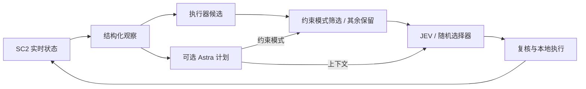

# 架构与接口

宏观系统分为观察、候选生成、动作选择与本地执行。Astra 是可选持续规划层，JEV 与均匀随机选择器实现相同的动作选择接口。

| 配置 | 规划 | Astra 按计划筛选 | 选择器 |
|---|---|---|---|
| 纯随机 | 无 | 否 | 均匀随机 |
| 纯 JEV | 无 | 否 | JEV |
| Astra 约束＋随机 | Astra | 是 | 均匀随机 |
| Astra 约束＋JEV | Astra | 是 | JEV |
| Astra 建议＋JEV | Astra | 否 | JEV |

约束模式将目标、预算和军队姿态转为候选与执行规则；建议模式只提供 JEV 上下文，不按计划裁剪动作、强制军队命令或仅因计划更新作废选择。执行器合法性、数量上限、冷却及命令生命周期规则保留，“不限制”专指没有 Astra 计划约束。

随机选择器在最终候选中均匀采样，包括 WAIT，不根据计划文字排序。纯随机不调用模型；Astra＋随机仍调用规划模型。工人分配、自动变形、导航及已有军队姿态由本地代码维护。

| 项目 | 宏观 | 微观 |
|---|---|---|
| 范围 | 完整 Protoss 对局 | SMAC-Hard 遭遇战 |
| 接口 | BurnySC2 | SMAC-Hard 修改版 PySC2 |
| 时序 | 实时，推理期间继续推进 | 固定步进，每次队伍决策后推进 8 loops |
| Astra | 周期与事件触发 | 每图一份计划，三局复用 |
| JEV | 每次一个宏观动作 | 每个存活单位一道 Choice |
| 输入 | 当前正常观察及反馈 | 共享队伍视野、公开配置及反馈 |
| 日志 | 请求、回复、计划、动作、结果 | 请求、回复、单位映射、原生反馈 |

模型不读取赛后回放真值，不获得迷雾中的实时敌方单位位置。论文回放截图用于展示与核验，不是模型输入。

详见[五种宏观配置](macro-configurations.md)、[宏观入口](../macro/README.md)和[微观入口](../micro/README.md)。
